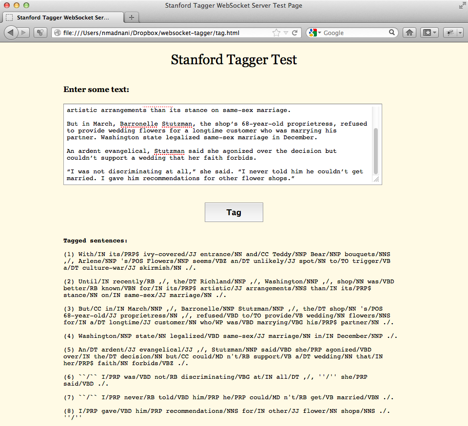

### websocket-tagger
==========

#### Description
This project provides a [WebSocket](http://en.wikipedia.org/wiki/WebSocket) server that wraps the [Stanford Part-of-Speech tagger](http://nlp.stanford.edu/software/tagger.shtml). This makes it easier to get part-of-speech tags from JavaScript for arbitrary text. Please note that this project is just a prototype that illustrates the utility of WebSockets for NLP.

#### Requirements
- Java
- Ant
- [Stanford CoreNLP](http://nlp.stanford.edu/software/corenlp.shtml)
- [Java WebSocket](https://github.com/TooTallNate/Java-WebSocket)
- A modern browser that supports WebSockets (See http://caniuse.com/websockets). I recommend the latest version of [Mozilla Firefox](http://www.getfirefox.com).

#### Installation:
1. Clone the Java WebSocket [repository](https://github.com/TooTallNate/Java-WebSocket) and build `java_websocket.jar` (you may also download the jar directly from the repository). Add this jar to your CLASSPATH.
2. Download `stanford-corenlp-1.3.5.jar` and `stanford-corenlp-1.3.5-models.jar` and add them to your CLASSPATH (Note: make sure to download the latest version which at this point happens to be 1.3.5)
3. Run `ant` to build the StanfordTaggerServer class.
4. Run the included script `start_server.sh` to start the WebSocket server.
5. Load `tag.html` into Firefox.
6. Tag away.

#### Notes:
1. Please note that currently the server needs to be killed manually since this is what I want. Obviously, this can be easily changed with the same thinking that goes into how to properly kill a regular socket server.
2. It should be simple to extend the server to do anything else CoreNLP can do besides tagging.

#### Screenshot:
Here's a screenshot of the jQuery powered `tag.html` page in action:

